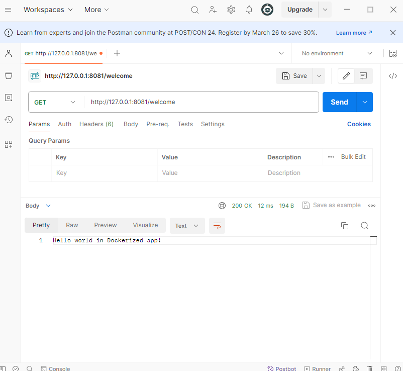

# Dockerized Spring Boot application

I was following [this tutorial](https://www.baeldung.com/dockerizing-spring-boot-application).
Below you can find some commands used for running this project using Docker.

## Running the project
When your Spring Boot application is ready, create an executable jar file:

```bash
mvn clean package
```

To dockerize the application, I first created a file named Dockerfile with the following content:
```dockerfile
FROM openjdk:17-jdk-alpine
COPY target/docker-demo-0.0.1-SNAPSHOT.jar springboot-docker-demo.jar
ENTRYPOINT ["java","-jar","/springboot-docker-demo.jar"]
```

Next, to create an image from our Dockerfile, use the following command:
```bash
docker build -t springbootapp .
```

Finally, to run the app, use this command:
```bash
docker run -p 8081:8081 springbootapp 
```

The application is now accessible via port *8081*. You can check it using your browser or [Postman](https://www.postman.com/):


Well done! :D
